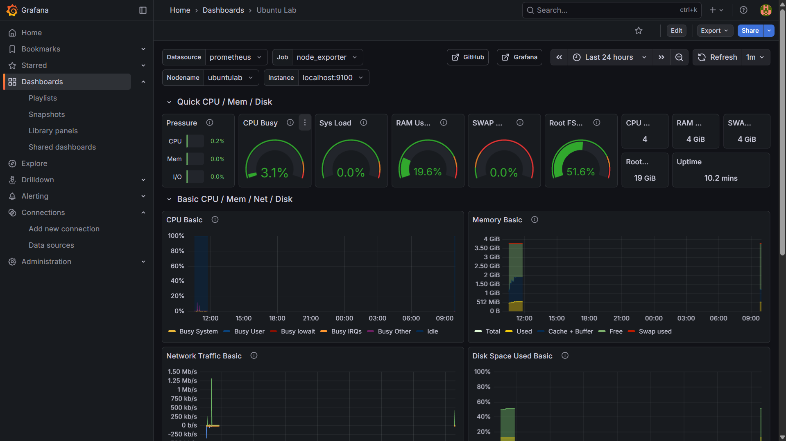
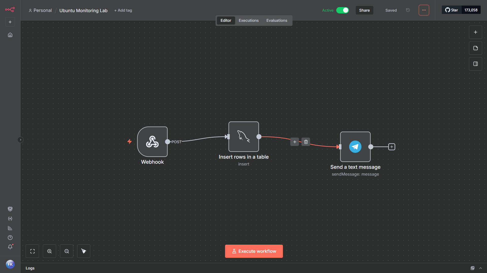
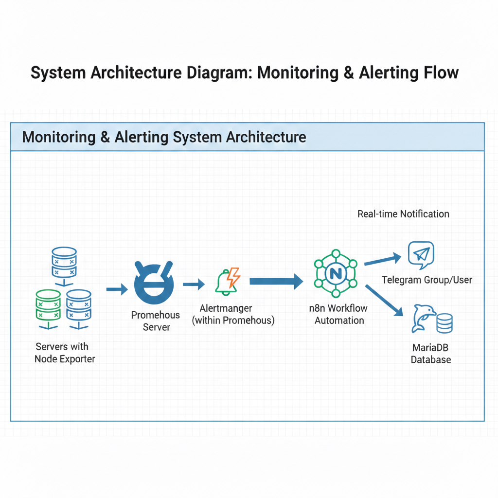

# Ubuntu Monitoring & Automation Lab

The **monitoring server lab** was created to monitor infrastructure and automate alerts using Prometheus, Grafana, n8n, and MariaDB.



---

## Objectives

- Monitoring server status
- Recording alert events to the database
- Sending automatic alerts to Telegram



---

## Stack

- Ubuntu Server
- Nginx
- Prometheus
- Grafana
- n8n
- MariaDB
- Docker

---

## Architecture

1. **Prometheus** collects metrics from Node Exporter.
2. When a server down/detected event is detected → **n8n** processes it.
3. n8n then forwards the alert to:
   - **Telegram**
   - **MariaDB database (alert log)**



---

## Requirements

- Telegram Bot Token + Chat ID untuk alert

---

## Installation & Setup

1. **Clone repo**
```bash
git clone https://github.com/FKfarell17108/ubuntu-monitoring-lab.git
cd ubuntu-monitoring-lab
```
   
2. **Docker Compose for n8n**
```bash
version: "3"

services:
  n8n:
    image: n8nio/n8n
    restart: always
    ports:
      - "5678:5678"
    environment:
      - N8N_BASIC_AUTH_ACTIVE=true
      - N8N_BASIC_AUTH_USER=admin
      - N8N_BASIC_AUTH_PASSWORD=035926
      - N8N_HOST=localhost
      - N8N_PORT=5678
      - WEBHOOK_TUNNEL_URL=http://localhost:5678
    volumes:
      - ./n8n-data:/home/node/.n8n
```

3. **Run Docker Compose**
```bash
docker compose up -d
```

---

## Official Software Release Sources

- **Node Exporter Releases**  
  [https://github.com/prometheus/node_exporter/releases](https://github.com/prometheus/node_exporter/releases)  

- **Prometheus Releases**  
  [https://github.com/prometheus/prometheus/releases/](https://github.com/prometheus/prometheus/releases/)  

---

## © 2026 Farell Kurniawan

Copyright © 2026 Farell Kurniawan. All rights reserved.  
Distribution and use of this code is permitted under the terms of the **MIT** license.


